# PETA报告模板制作指南

PETA使用Jupyter Notebook文件制作分析报告模板，代码与Markdown的Cell是内容的最小组织单位，使用Jupyter_web_report包控制结果html文件中各Cell的显示行为。在代码Cell中，使用pypeta包与BGI-PETA数据库进行交互。

## 环境配置
- 操作系统不限
- python >3.7
- jupyter >1.0.0
- pypeta >0.2.0
- jupyter_web_report >0.2.0
- R >3.5.1

## 概念
jupyter notebook: Jupyter notebook，是一个开放源代码的交互式笔记本框架，支持Python，R等40多种编程语言。Jupyter notebook是一种Web应用，能让用户将说明文本，数学方程、代码和可视化内容组合到一个易于分享的文件中。由于其便利性，Jupyter notebook迅速成为数据分析、机器学习领域的必备工具和事实标准。

markdown: Markdown是一种轻量级标记语言，它允许人们使用易读易写的纯文本格式编写文档，然后转换成有效的html文档。由于Markdown的轻量化、易读易写特性，并且对于图片，图表、数学式都有支持，目前许多网站都广泛使用Markdown来撰写帮助文档。

jupyter_web_report: jupyter_web_report是BGI-PETA团队开发发布的Python软件包，安装后可执行程序简称为jwr，是一套供用户使用jupyter notebook做为分析模板，生成html报告的命令行工具，是基于python语言，基于jupyter项目框架，开发出来的一套适用于jupyter notebook报告模板解决方案软件。jupyter_web_report项目地址在[https://github.com/JaylanLiu/jupyter-web-report](https://github.com/JaylanLiu/jupyter-web-report)。Jupyter-web-report程序主要提供以下三项功能：

1. 传递命令行参数到jupyter notebook中；
1. 命令行执行完整jupyter notebook；
1. Jupyter notebook单元格级别精度的输出控制。

pypeta：pypeta是BGI-PETA数据库团队开发发布的Python软件包，是BGI-PETA数据库提供的代码接口，提供了在代码端登陆、查询BGI-PETA数据库的功能，并提供了在基因组学分析中常用的工具函数。pypeta项目地址为[https://github.com/JaylanLiu/pypeta](https://github.com/JaylanLiu/pypeta)。

cell：cell是jupyter notebook中的内容最小组织单元。一个cell包括In和Out两个部分，In部分用于输入内容，Out部分用于显示代码的运行结果，包括可视化和结果输出。cell有类型属性，代码属性的cell用来组织代码，可运行并产生结果，结果产生于Cell的Out部分，markdown属性的cell用来渲染markdown格式的文本，运行后直接生成渲染后的文档，去除In和Out的标识。

tag：tag是对cell添加的标签，用以对cell进行标记指导后续jupyter_web_reprot模块对notebook的显示控制。jupyter_web_report目前支持四种标签控制cell在结果html中的显示行为，带“hide”标签的cell不显示，带“output”标签的cell只显示运行结果的Out部分，不显示In的部分，不带以上两种标签的cell同时显示In和Out部分。tag也可用于标识cell中代码的功能，如“interaction”标签标示cell是当前notebook与数据库进行交互的代码。
   | tag    | 报告中cell表现      |
   | ------ | ------------------- |
   | 无tag  | 显示In和Out         |
   | hide   | 不显示              |
   | output | 只显示Out，不显示In |

结果html：指jwr驱动运行模板后生成的网页结果。

## 写作规范
PETA数据库支持基于Python和基于R语言制作分析模板，提供可复用的参考示例。基于Python的模板示例见[https://github.com/JaylanLiu/PETA_report_template__Python__Product_statistics](https://github.com/JaylanLiu/PETA_report_template__Python__Product_statistics)，基于R语言的模板示例见[https://github.com/JaylanLiu/PETA_report_template__R__genome_landscape](https://github.com/JaylanLiu/PETA_report_template__R__genome_landscape)。示例模板中给出了模板与BGI-PETA数据库的交互代码，该部分代码在制作新模板时可复用。

**用户制作模板时，建议从github下载示例模板，复用模板中的前三个cell，从第四个cell起开始分析代码。**

以下详细介绍中默认以基于Python的模板做为示例，基于R的模板有特殊用法需要注意时会同时给出基于R的模板的示例。

### 文件组织
PETA报告模板是一个文件夹，代码与文档封装到一个jupyter notebook的ipynb文件中，ipynb文件的名称前缀和文件夹相同。代码中的引入的包及模块写在requirements文件中，代码中引用的数据文件直接放到文件夹下，在代码中使用相对路径引用。模板安装时，系统使用conda根据requiremnets中的列表初始化运行环境。模板的说明以markdown格式写在README.md文件中，模板上传PETA数据库后将提取README.md中的内容做为模板的说明描述。LICENSE文件中为模板遵循的开源协议。

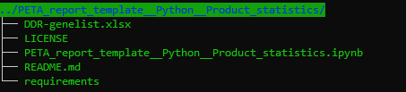

### 运行环境
模板中需要引入的钯及模板写在requirements文件中，必要时请指定版本。模板安装时，后台系统根据requirements文件中的内容为模板初始化虚拟运行环境。
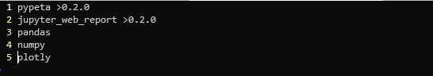

### 模板说明文档
README.md文件中的内容组成该模板的说明文档。模板说明文档中要写明模板的主题，创建人及联系方式，使用的分析方法和分析内容，支持的数据集，模板使用jwr调用的命令行等信息。

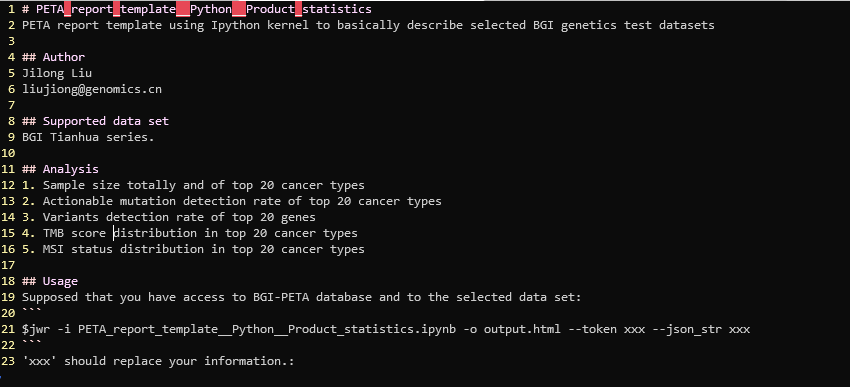

### Jupyter notebook标签设置
如用户从头开始启动jupyter notebook，按如下步骤做设置：
1. 启动本地jupyter服务，以R kernel新建笔记本
    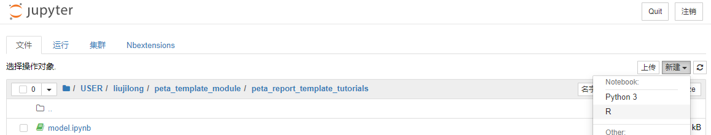
2. 调出标签模式。

    菜单栏->单元格工具栏-->Tags
    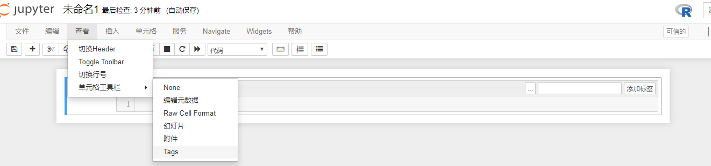

### 参数化
模板需要从Jupyter notebook外部传入的参数加测试时缺省值依次写入第一个cell中，并认“parameters” tag 标记该cell。“parameters”标记的cell不显示在结果html中。
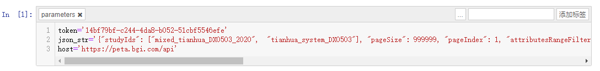

### 模块/程序包引入
第三方模板、程序包引入，如Python中的`import`语句和R中的`library`语句，依次写在第二个cell中。如作者不希望在结果html中显示该cell，则需要用“hide” tag标记该cell。
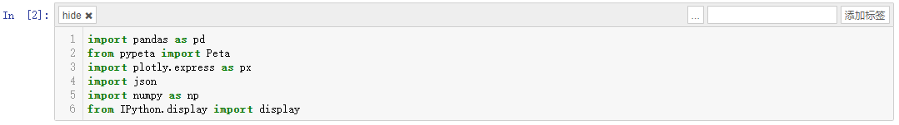
在基于R的模板中需要额外引入`reticulate`包调用pypeta Python程序包：
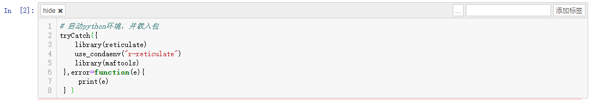

### 数据库交互
PETA报告模板的运行时由jupyter_web_report包调度，PETA报告模板支持IPython和IR kernel，模板中均使用pypeta python包与数据库进行交互，在R中需要。

与PETA数据库交互的代码写在模板的第三个cell中，该部分代码根据当前用户的token和圈选数据的json字符串从PETA数据库中申请取回数据，转换为pandas/R的DataFrame数据结构后将临床信息和突变数据分别存储于cli和mut变量中，供下游分析使用。该cell可由“interaction”标签标记，仅做提示。**在制作新模板时，前三个cell请直接复用示例代码。**

基于Python的模板，数据库交互cell示例为：
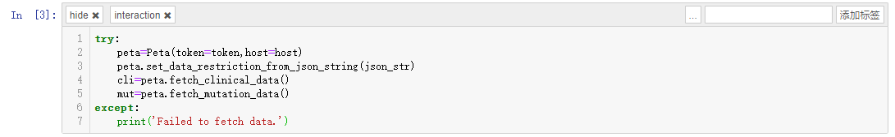

基于R的模板，数据库交互cell示例为：
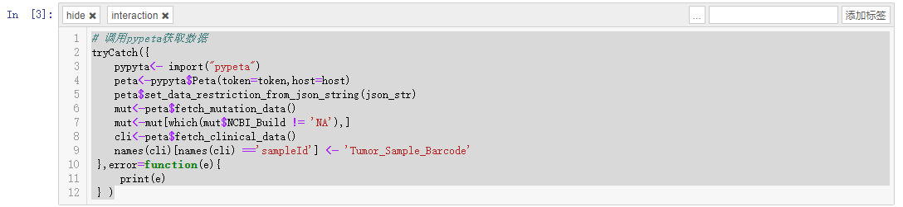

### 模板展示内容正文
此部分代码对mut和cli变量中的数据进行加工分析，得到可视化结果。标题及大片段的描述文字以markdown的形式书写在markdown类型的cell中：
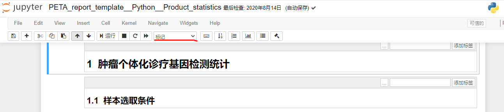
基础计算的代码按功能封装到“hide”标签标记的cell中：
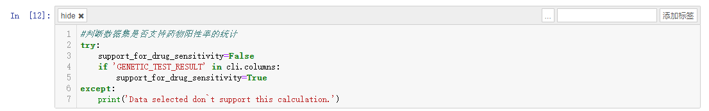
产生文本内容和可视化的代码封装到“output”标记的cell中，使用print()函数输出文本内容，使用图像对象的show()方法绘制图像：
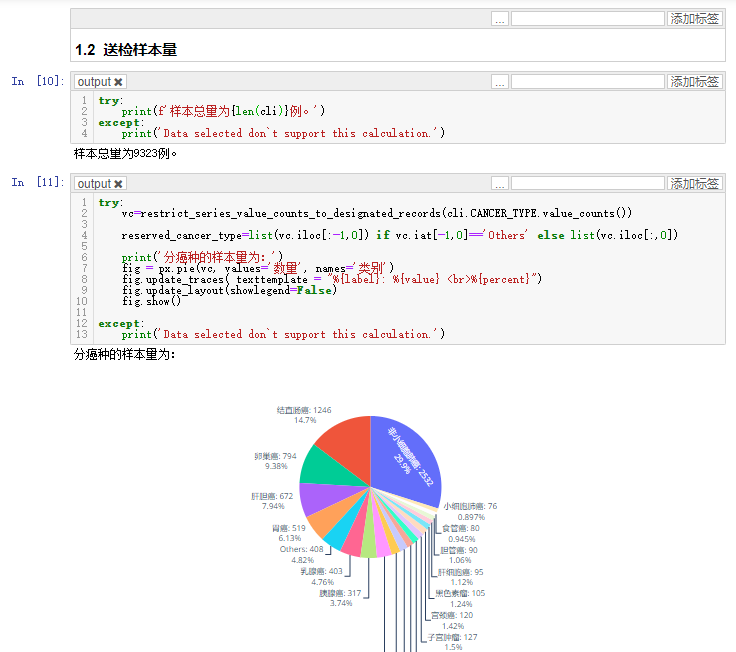

### 异常控制
jwr驱动模板运行代码时，以cell为单元，按照顺序执行每个cell。如果执行到某个cell时，其中的代码发生错误，抛出异常，模板运行结束，jwr捕获出错信号和异常信息返回到服务器端，生成只包含部分结果的分析报告。因此建议在每个cell中，对代码进行异常控制，给出更针对性的易于理解的错误提示。在基于IPython kernel的模板中使用try..except...结构:
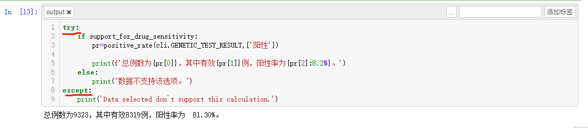
在基于IR kernel的模板中使用tryCatch(...)结构:
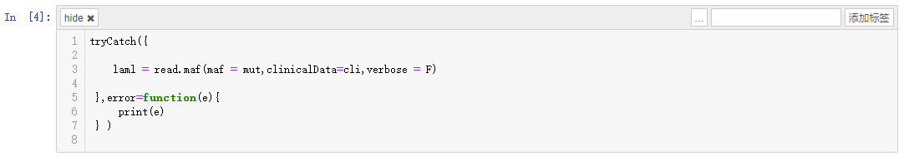

### 函数输出控制
有些包或函数在引入或应用过程中会在标准错误流或者标准输出流中产生默认输出，而这些输出通常是警告信息，并不是作者想要输出到最终报告中的内容。
在基于Python的模板中，可使用`contextlib`包中的`redirect_stdout`和`redirect_stderr`来分别捕获标准输出流和标准错误流中的内容：
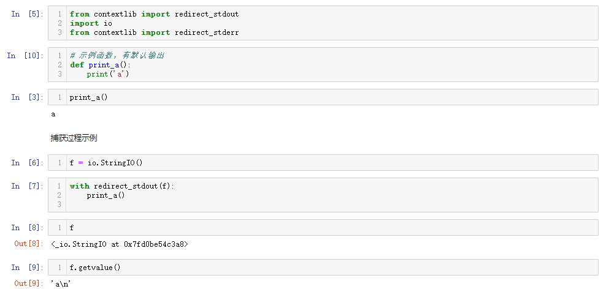

在基于R的模板中，可使用`suppressMessages`和`suppressWarnings`函数来依次屏蔽标准输出流和标准错误流：
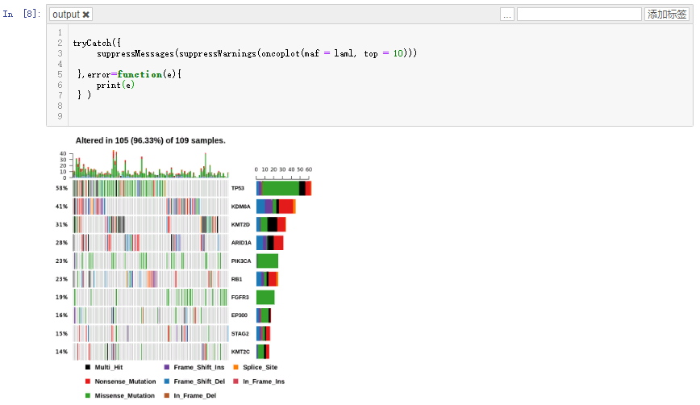

### 模板运行过程
模板运行过程中与PETA数据库交互过程可以概括为以下三步：
1. jupyter_web_report包的可执行程序jwr从命令行接收要传入模板文件中的参数，包括当前用户的token、在PETA数据库中圈选数据的json字符串、PETA数据库域名等，将参数写入到模板中的“parameter”标签标记的cell中的对应变量中，
2. 然后jwr控制依序运行各个CELL。引入pypeta包，在第三个cell中根据当前用户的token和圈选数据的json字符串从PETA数据库中申请取回数据，转换为pandas DataFrame数据结构后将临床信息和突变数据分别存储于cli和mut变量中，供下游分析使用。下游分析及可视化代码对cli和mut中的数据进行加工处理生成结果。

3. jwr 收集汇总各cell的输出，根据cell的tag确定cell的显示行为，格式化成为html文档。

